## Learning Objectives

*   Understand how to use Git from RStudio
*   Integrating Git with existing R projects

## Using Git with RStudio
Since version control is so useful when developing scripts, RStudio has built-in integration with Git. There are some more obscure Git features that you still need to use the command-line for, but RStudio has a nice interface for most common operations.

RStudio let's you create a 
[project](https://support.rstudio.com/hc/en-us/articles/200526207-Using-Projects) associated with a given directory. We have done this many times in the course so far. When we create a new project, RStudio has a feature in which we can keep track of related files using version control! 

To get started using RStudio for version control, let's make a **new project**:  
    
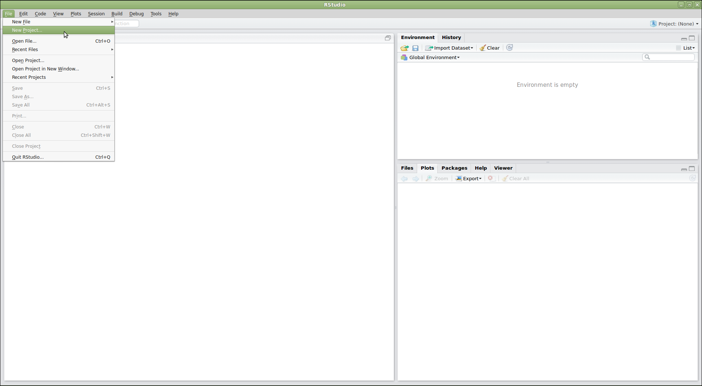   

This will pop up a window asking us how we want to create the project. We have
some options here. Let's say that we want to use RStudio with the planets
repository that we already made. Since that repository lives in a directory on
our computer, we'll choose **existing directory**:  

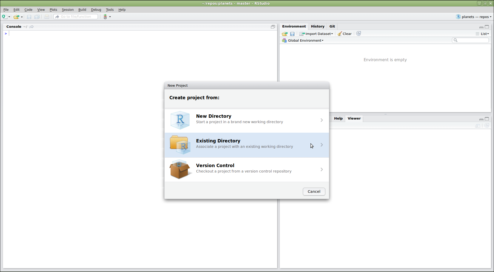

> ## Do you see a "version control" option?
>
> Although we're not going to use it here, there should be a "version control"
> option on this menu. That is what you would click on if you wanted to
> create a project on your computer by cloning a repository from github.
> If that option is not present, it probably means that RStudio doesn't know
> where your git executable is. See 
> [this page](https://stat545-ubc.github.io/git03_rstudio-meet-git.html) 
> for some debugging advice.
  
  
Next, RStudio will ask which existing directory we want to use. Click  <kbd>Browse</kbd>
to navigate to the correct directory on your computer, then click <kbd>Create 
Project</kbd>:  

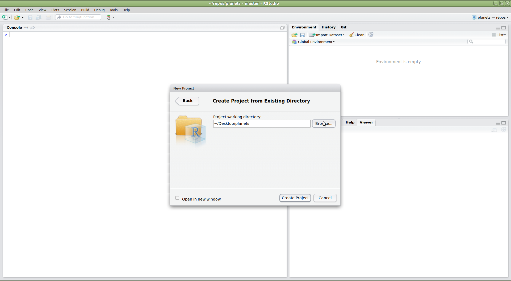

Ta-da! Now you have an R project containing your repository. **Notice the
vertical <kbd>Git</kbd> menu that is now on the menu bar.** This means RStudio has
recognized that this directory is a git repository, so it's giving you tools
to use Git:  

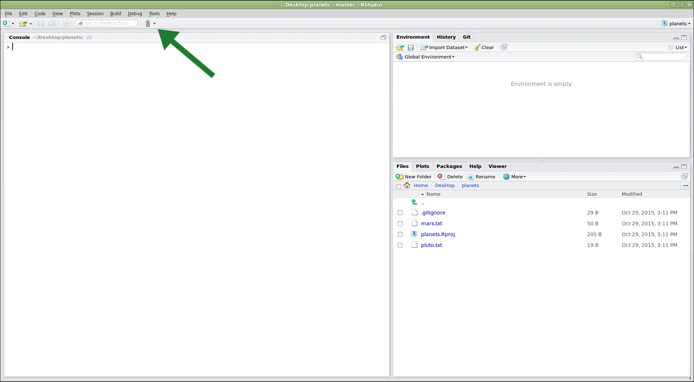

To **edit the files** in your repository, you can click on them from the panel in
the lower right. Let's add some more information about pluto to `pluto.txt`:  

	And it's nice and out of the way.

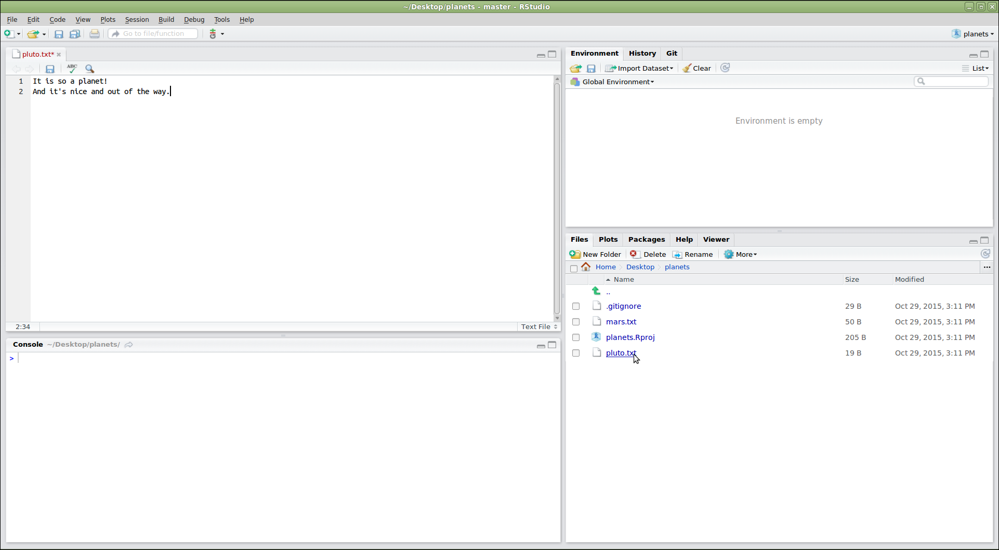

We can also use RStudio to **commit these changes**. Go to the Git menu and click <kbd>Commit</kbd>:  

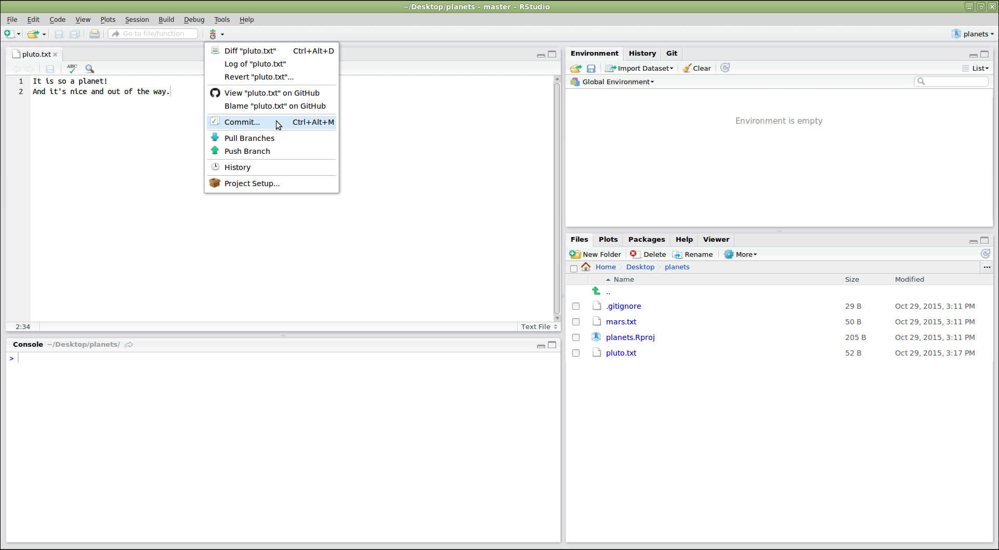

This will bring up a screen where you can **select which files** to commit (check the boxes in the "staged" column) and enter a **commit message** (in the upper right). The icons in the "status" column indicate the current status of each file. You can also see the changes to each file by clicking on its name. Once everything is the way you want it, click <kbd>Commit</kbd>:  

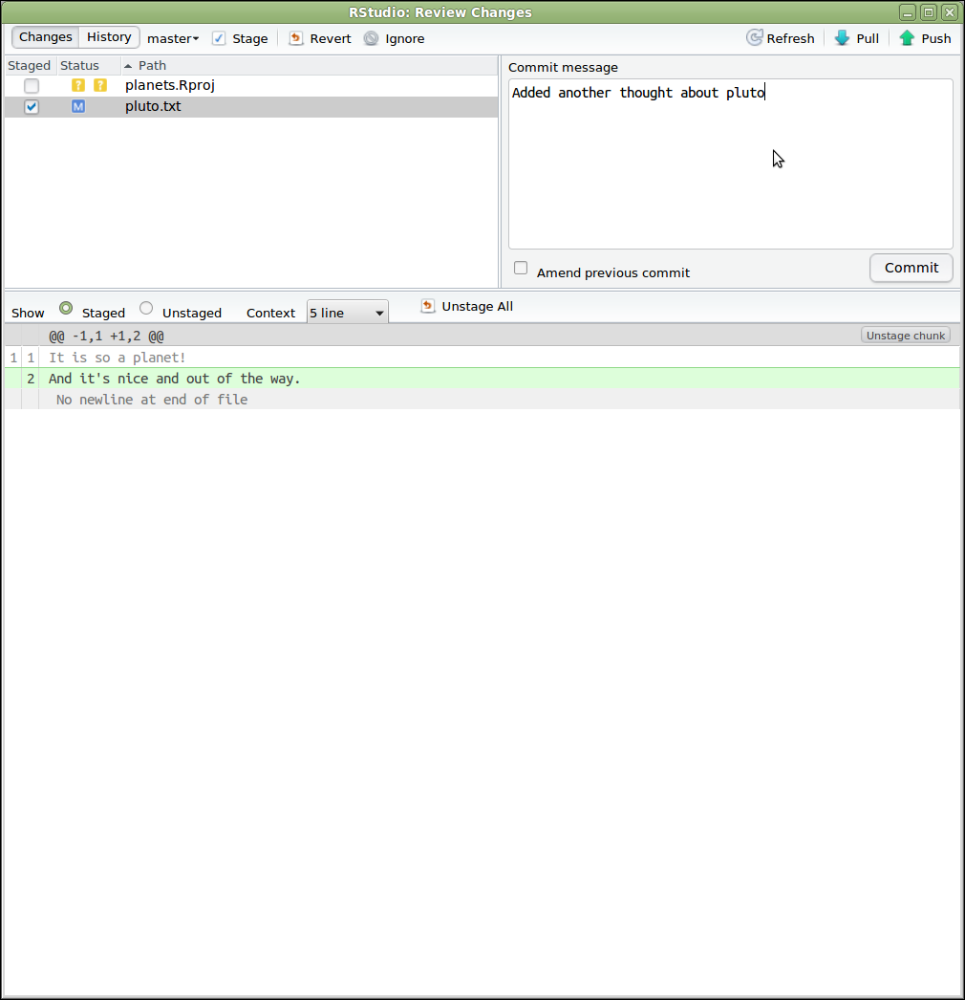

You can **push these changes** by selecting <kbd>Push</kbd> from the Git menu. There are
also options there to pull from a remote version of the repository, and view
the history:    

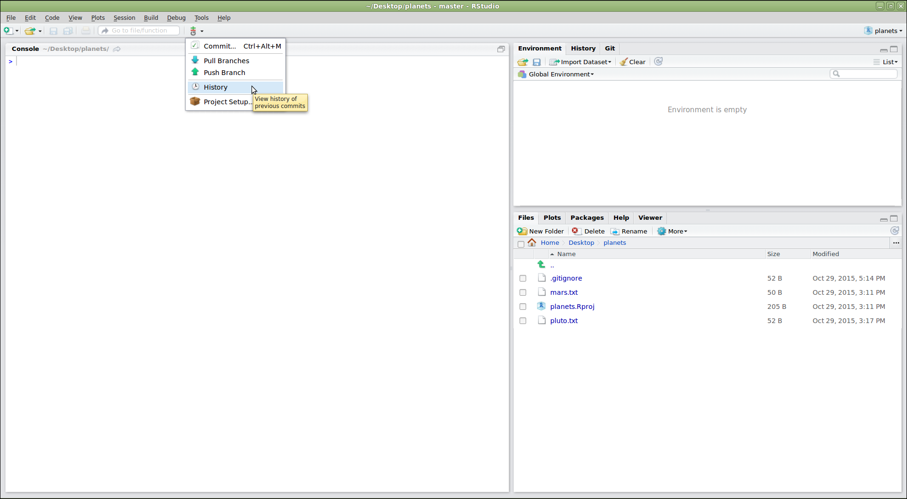

> ## Are the push/pull commands greyed out?
>
> If this is the case, it generally means that RStudio doesn't know the
> location of any other version of your repository (i.e. the one on Github).
> To fix this, open a terminal to the repository and enter the command:
> `git push -u origin master`. Then restart RStudio.
  

If we click on "history", we can see a pretty graphical version of what 
`git log` would tell us:  

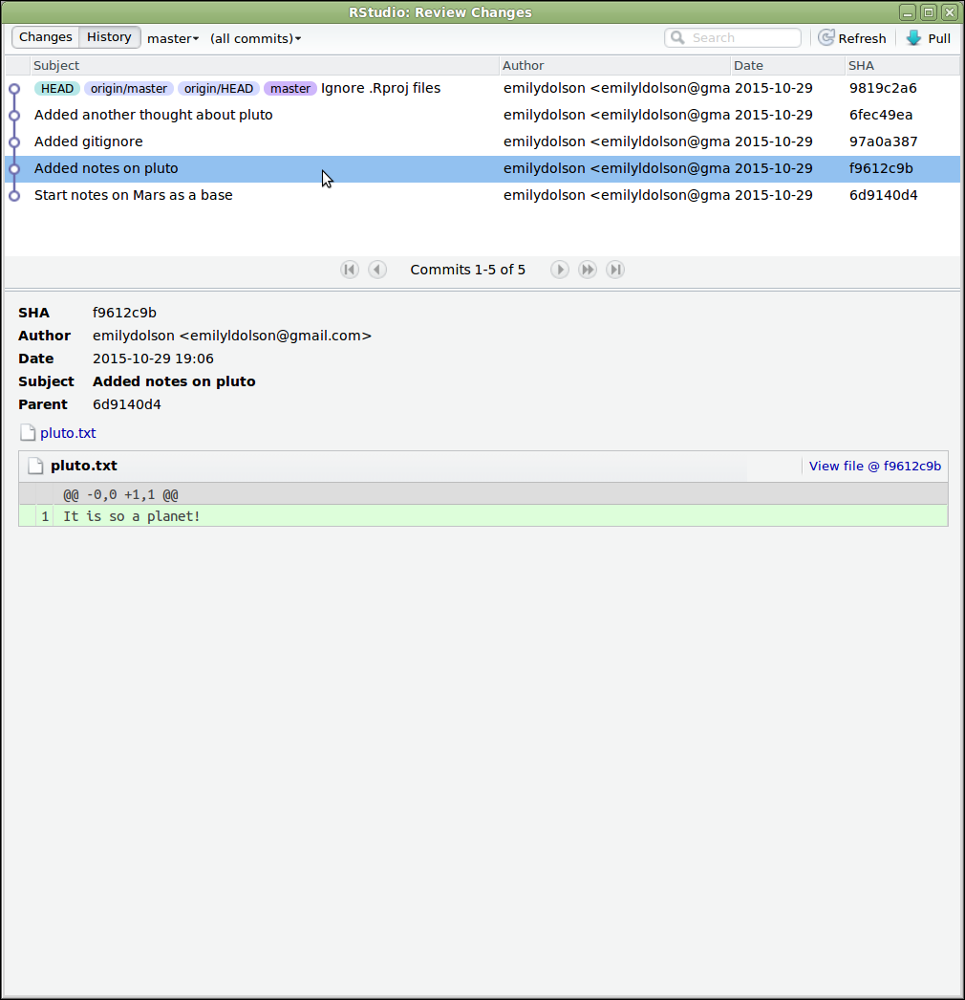

RStudio creates some files that is uses to keep track of your project. You
generally don't want to track these, so adding them to your .gitignore file
is a good idea:  

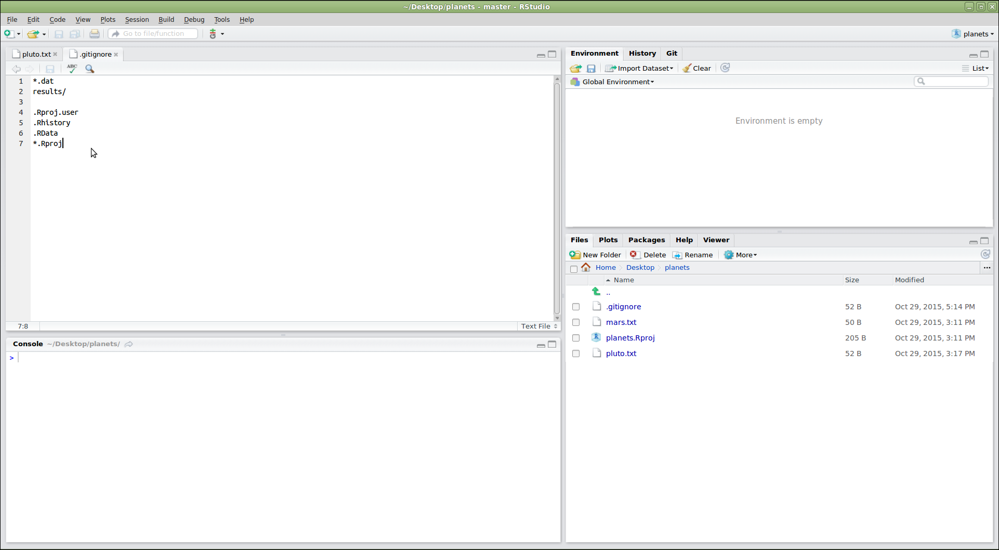

> **NOTE:** When using Git versioning for R projects for your NGS Data Analysis it is best practice not to commit your data files. Binary files in particular will be problematic, as **Git is designed to track text changes not data**. Thus, adding data file extensions (i.e `.bam`) or folders which only contain data files in your `.gitignore` can be very useful so those files are not accidently tracked.  

## Git Large File Storage (LFS)

There may be large files that you want to track (i.e PDF, rda, xlsx, html) and the standard Git workflow is not as efficient at doing this. [Git LFS](https://git-lfs.github.com/) is a new command line extension and specification for managing large files with Git. 

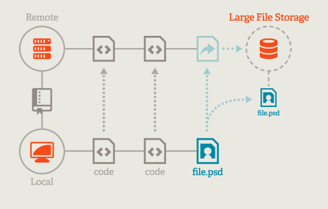

Some features of Git LFS are listed below:

* **Faster cloning and fetching**. Git LFS is configured to download less data. This means faster cloning and fetching from repositories that deal with large files.
* **Same Git workflow**. Aside from the install and tracking the specific large files (`git lfs track`), work like you always do on Git. No need for additional commands, secondary storage systems, or toolsets.
* **Same access controls and permissions**. Keep the same access controls and permissions for large files as the rest of your Git repository.

> **NOTE:** There is a charge for Git LFS as it uses AWS in the back-end. If you wanted to test it out first with smaller files, it is free until you hit a certain quota.

## Integrating Git with an existing RStudio project

So far in this course we have created projects in RStudio, but we have not used Git integration. Now that you have seen how useful it can be, perhaps you want to go back to some your old projects and start tracking changes. 

Rstudio allows for this pretty easily, and here we show you how.

1. Open up the `DEanalyis.Rproj`.
2. From the menu bar select 'Tools' -> 'Version Control' -> 'Project Setup...' 

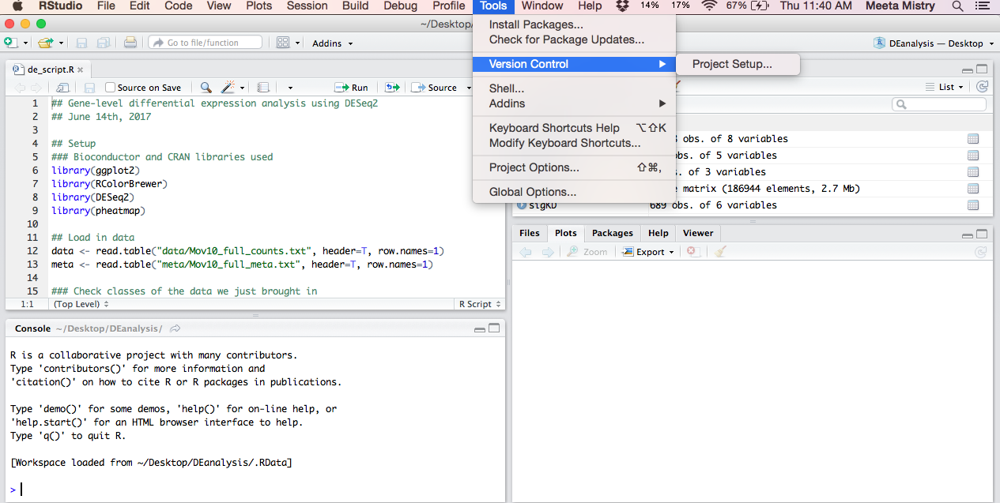

3. This will open up the 'Project Options' box. From the pull-down menu select <kbd>Git</kbd>. You will then be asked to confirm creating a new repository and asked to restart RStudio.

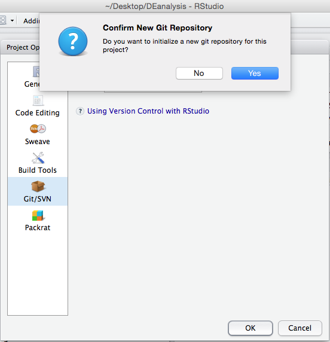

Now in the top right panel (Environment/History) of RStudio you will see a tab for <kbd>Git</kbd>. You can now get started with version control on any of your existing script/markdown files!

