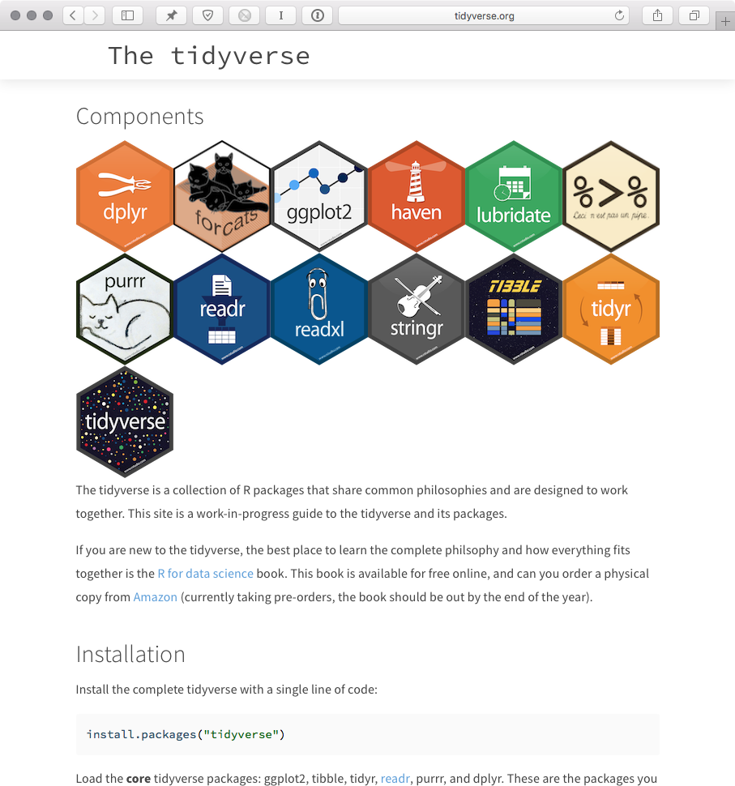

The [tidyverse][] is a suite of integrated packages designed to make common operations performed in [R][] more user friendly.




* * *


# Installation

The core collection of tidyverse packages are managed by the [tidyverse CRAN package](https://cran.r-project.org/web/packages/tidyverse/index.html).

```{r install, eval=FALSE}
install.packages("tidyverse")
```

```{r setup}
library(tidyverse)
```

When you load the `tidyverse` library, these core packages will be loaded into your environment:

- [ggplot2][]
- [tibble][]
- [tidyr][]
- [readr][]
- [purr][]
- [dplyr][]


## Recommended optional packages

There are a number of additional [tidyverse][] packages that we highly recommend for performing data analysis, including:

- [magrittr][]: Defines the pipe operator (`%>%`), which is used to write left-to-right chain operations. We'll cover this below.
- [stringr][]: Enables easier manipulation of vectors ("strings").
- [readxl][]: Current recommended best practice for import of Excel workbooks.


## Function name conflicts

When you load the [tidyverse][], you'll see messages about tidy package conflicts at the end. *This is normal.* Currently, [dplyr][] masks `stats::filter()` and `stats::lag()` by default. What's happening here is that the [tidyverse][] has some functions with the same names as base [R][] packages.

**Note**: This remains a common issue when loading multiple libraries in a single script. For example, many [Bioconductor][] packages have generic functions with the same name as base [R][] and [tidyverse][] packages. For example, `biomaRt::select()` and `dplyr::select()` have the same function name but require different arguments. Whichever library you load last will define the function name (`select()`). If you need to use two packages with the same function name at the same time, you can reference them explicitly (e.g. `dplyr::select()`). Therefore, when starting a new analysis using [tidyverse][] packages, we highly recommend slotting `library(tidyverse)` at the end of your list of libraries.


# Load the example data

```{r example_data}
results_dir <- file.path(
    "https://raw.githubusercontent.com",
    "hbctraining",
    "In-depth-NGS-Data-Analysis-Course",
    "may2017",
    "sessionVI",
    "results")
counts_mat <- file.path(results_dir, "counts.txt") %>%
    read.table %>%
    as.matrix
counts_tbl <- counts_mat %>%
    as.data.frame %>%
    as_tibble %>%
    rownames_to_column("ensgene")
meta_tbl <- file.path(results_dir, "meta.txt") %>%
    read.table %>%
    as_tibble %>%
    rownames_to_column("sample_name") %>%
    rename(sample_type = sampletype,
           mov_expression = MOVexpr) %>%
    mutate(sample_name = tolower(sample_name))
results_tbl <- file.path(results_dir, "results_Mov10_oe.txt") %>%
    read.table %>%
    as_tibble %>%
    rownames_to_column("symbol")
```


# tibbles

A core component of the [tidyverse][] is the [tibble][]. Tibbles are a modern rework of the standard `data.frame`, with some internal improvements to make code more reliable. Most notably, tibbles will return a more reasonable number of rows to the console.

Try executing `counts` in your console:

```{r}
counts_tbl
```

See how [R][] only prints 10 rows instead of returning all 38k?

Internally, a [tibble][] is essentially a class variant of `data.frame`, with some extra tibble (`tbl`) magic baked in:

```{r}
class(meta_tbl)
```

`glimpse()` is a modern rework of `str()`, optimized for tibbles:

```{r, eval=FALSE}
glimpse(counts_tbl)
glimpse(meta_tbl)
glimpse(results_tbl)
```


# Code style

One problem with [R][] is a lack of consistency across packages in how functions and arguments are named.

- Base [R][] functions are formatted in dotted case: `read.csv()`.
- [tidyverse][] functions are formatted in snake_case: `read_csv()`.
- [Bioconductor][] functions are generally formatted in lowerCamelCase (and sometimes UpperCamelCase).

The [tidyverse][] collection of packages are very opinionated in this regard and consistently use `snake_case` formatting for all function names and arguments. When using these functions, we recommend that you follow the [tidy style guide][].


# Non-standard evaluation

[tidyverse][] packages improve code readability by changing how functions interpret object names. This is achieved through the use of "non-standard evaluation" instead of base [R][]'s "standard evaluation". This probably sounds confusing but is actually pretty simple. In fact, we've already used a function (`subset()`) in the class that works with non-standard evaluation.

```{r subset}
subset(meta_tbl, mov_expression == "high")
```

Here's the [tidyverse][] variant:

```{r filter}
filter(meta_tbl, mov_expression == "high")
```

See how both functions refer to `mov_expression` directly and not in quotations? That's *non-standard evaluation*. It makes code easier to read.


# dplyr

The most useful tool in the [tidyverse][] is [dplyr][]. It's a swiss-army knife for data manipulation. [dplyr][] has 5 core functions that we recommend incorporating into your analysis:

- `mutate()` adds new variables that are functions of existing variables
- `select()` picks variables based on their names.
- `filter()` picks cases based on their values.
- `summarise()` reduces multiple values down to a single summary.
- `arrange()` changes the ordering of the rows.


* * *


# Notes

## Programming

Underneath the hood, [tidyverse][] packages build upon the base [R][] language using [rlang][], which is a **complete rework** of how functions handle variable names and evaluate arguments. This is achieved through the `tidyeval` framework, which interprates command operations using `tidy evaluation`. This is outside of the scope of the course, but explained in detail in the [Programming with dplyr](http://dplyr.tidyverse.org/articles/programming.html) vignette, in case you'd like to understand how these new tools behave differently from base [R][].


## Row names

*Important*: [tidyverse][] is very opininationed about row names. These packages insist that all column data (e.g. `data.frame`) be treated equally, and that special designation of a column as `rownames` should be deprecated. [tibble][] provides simple utility functions to to handle rownames: `rownames_to_column()` and `columns_to_rowname()`.


# Additional resources

- [R for Data Science](http://r4ds.had.co.nz)
- [teach the tidyverse](http://varianceexplained.org/r/teach-tidyverse/)
- [tidy style guide][]


[Bioconductor]: https://bioconductor.org/
[dplyr]: http://dplyr.tidyverse.org/
[ggplot2]: http://ggplot2.tidyverse.org/
[magrittr]: http://magrittr.tidyverse.org/
[purr]: http://purrr.tidyverse.org/
[R]: https://www.r-project.org/
[readr]: http://readr.tidyverse.org/
[readxl]: http://readxl.tidyverse.org/
[rlang]: https://github.com/tidyverse/rlang/
[stringr]: http://stringr.tidyverse.org/
[tibble]: http://tibble.tidyverse.org/
[tidy style guide]: http://style.tidyverse.org/
[tidyr]: http://tidyr.tidyverse.org/
[tidyverse]: http://tidyverse.org/
